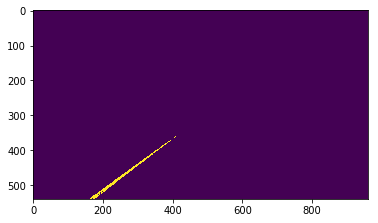
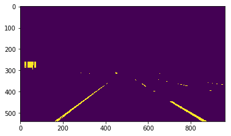
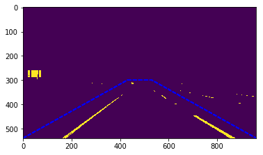
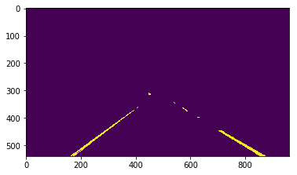
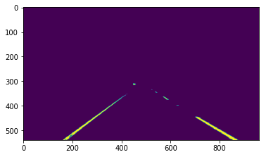
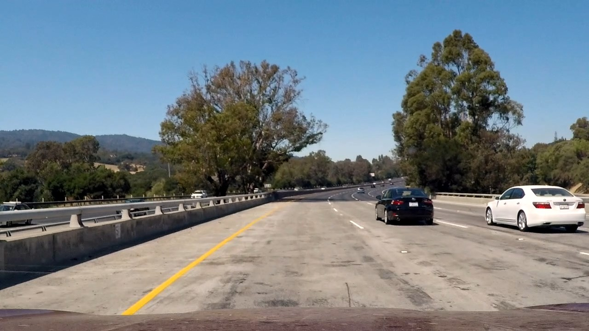

# **Project 1: Lane lines identification**

## **Objectives**
- Identify lane lines on the road using images from a camera installed on a car.
- Draw the identified lane lines over the original image.

## 1. How the pipeline works?

### funtion process_image(image)
This funtion encapsulates the actual image processing pipeline of the project. Inside, other functions are called in order to identifify the lane lines.

**Input:** Images from car's camera

**Output:** Images with the identified lane lines overlaid.

### Step 1: Color filtering - function colorFilter(image, lowerColor, UpperColor)
First, the input images is filtered by colors. The lane lines are tipically white or yellow, so these two colors parameters are preselected. However, the tone of these colors doesn't remain constant overtime, or even in the same picture frame, due to changing light conditions and camera parameters (like ISO). For that reason, for each these two colors, a pre-specified range of RGB values, defined in the **lowerColor** and **upperColor** variables.

Let's start with the initial image.

Now, only the white pixels are filtered. 

Next, only the yellow ones.

The two previous images are combined into one using the **OR bitwise** operation.

### Step 2: Image masking - function roi(image, vertices)

As you may imagine, in some cases, not only the lane lines are white and yellow. In this example, there is a white panel on the left side. This may create unwanted artifacts in the processed image. In order to filter that, a trapezoidal mask is implemented. The variable *vertices* defines the vertices of the shape to mask.
The mask is shown in blue dashed lines.

And this is the final result after masking the image.

### Step 3: Gaussian smoothing - function gaussianBlur(image,kernel_size)

To reduce the uneven edges of the filtered lines, a gaussian smoothing is applied to the whole imaged. The degree of the aliasing is defined by the variables kernel_size.

### Step 4: Hough lines transformation algorithm for lines detection - function hough_lines(image, rho, theta, threshold, min_line_length, max_line_gap)

The Hough algorithm transform the space of the image from X,Y cartesian coordinates space to a polar representation. Parallel lines in X,Y can be found by finding the intersection of curves in the polar space, as shown in the image below.

(image extracted from the opencv documentation)-

The minimum number of intersections in order to define a line can be tuned with the *threshold* variable. The other variable define the resolution of the transformation, and the relation between multiple lines in the same figure. The output of this function is a tuple of vectors defined as **[x1 y1 x1 y2]** that indicates a detected line.

**Note:** In this project, the canny edge detection is not used, since this algorithm reduces the number of available points for the Hough transformation function. If less points are avaible, the Hough line algorithm may have problems finding the lines. This can be problematic in cases were the quality image is not high enough to distinguish the lane lines, as in the challenge video (see image below), in which in some frames, the lanes on the right side are partially absent. The color filtering algorithm by itself make a good job at detecting the lanes, while leaving enough data points for the Hough algorithm.

### Step 5: Polynomial fitting to determine the lines equations - function laneLinesFit(houghLines, poly_degree)

The points found by the Hough Lines function are fed into the the polynomial fitting function. First, this function segregate which lines are from the left, and which are from the right side. Then, the (X,Y) points are used to fine the best fitting polynomial that represent each curve. In this case, a polynomial of first degree is used (a simple line). However, higher degrees can be used, by changing a few lines of code. This can be useful in closer curves paths.

### Step 6: Drawing the identified lines over the original image  - function drawLines(image,leftCurve,rightCurve,verLim)

Finally, the identified line equations are drawed over the original image. The inputs are the original input image, the left and right curve equation parameters *leftCurve* and *rightCurve* and the vertial limit *verLim*.
Notice that the equations are defined as **x = f(y)**, because it is more convenient in the image space frame.
The identified lane lines are shown in red.

## 2. Potential shortcomings in the current version

In the current version, the filter's parameters have been manually tuned in order to work only in the given data set. However, if different image conditions (like size or light) are present in future video inputs, the pipeline may fail at some frames. 

Also, if the lane line painting quality is not adequate, or the size of the lanes are reduced in some parts of the road, as in the challenge video, the pipeline may turn unstable. Even though the current pipeline works in the challenge video, in some parts, the detected line "shakes" a little bit, because the information of the road is very limited. 

See the image in the Hough algorithm part. *(is there a way to reference images in Markdown?)*
In this case, only the lanes at the top can be used to determine the position of the line.

Finally, the current pipeline only determines straigh lines, which may be inadequate at closer curves.

## 3: Future work
Nowadays, cameras can automatically adjust and register the ISO quality. This information could be used to detect changes in the light conditions and adjust the filters automatically.

Also, it could useful that the pipeline adjust the region of interest automatically, so it can be "frame size agnostic", which reduce the setup time in future implementations with different cameras or lenses. Or even better, an algorithm that does not need a ROI to detect the lanes.

When the quality of the painted lanes is very low, it could possible to use information from previous frames in order to predict the position of future lane lines. More or less like a Kalman filter.

Finally, as mentioned earlier, the current pipeline only identifies straight lines. However, the pipeline is prepared to fit higher polynomial orders, by changing a few lines of code. This can improve the fitting index in closer curves.
