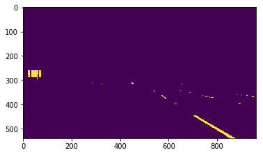

# **Project 1: Lane lines identification**

## **Objectives**
- Identify lane lines on the road using images from a camera installed on a car.
- Draw the identified lane lines over the original image.

## 1. How the pipeline works?

### funtion **process_image(image)
This funtion encapsulates the actual image processing pipeline of the project. Inside, other functions are called in order to identifify the lane lines.

**Input: Images from car's camera

**Output: Images with the identified lane lines overlaid.

### Step 1: Color filtering - function **colorFilter(image, lowerColor, UpperColor)
First, the input images is filtered by colors. The lane lines are tipically white or yellow, so these two colors parameters are preselected. However, the tone of these colors doesn't remain constant overtime, or even in the same picture frame, due to changing light conditions and camera parametes (like ISO). For that reason, for each these two colors, a pre-specified range of RGB values, defined in the **lowerColor** and **upperColor** variables.

