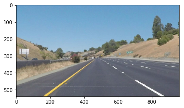

# **Project 1: Lane lines identification**

## **Objectives**
- Identify lane lines on the road using images from a camera installed on a car.
- Draw the identified lane lines over the original image.

## 1. How the pipeline works?

### funtion **process_image(image)
This funtion encapsulates the actual image processing pipeline of the project. Inside, other functions are called in order to identifify the lane lines.

**Input: Images from car's camera

**Output: Images with the identified lane lines overlaid.

### Step 1: Color filtering - function colorFilter(image, lowerColor, UpperColor)
First, the input images is filtered by colors. The lane lines are tipically white or yellow, so these two colors parameters are preselected. However, the tone of these colors doesn't remain constant overtime, or even in the same picture frame, due to changing light conditions and camera parametes (like ISO). For that reason, for each these two colors, a pre-specified range of RGB values, defined in the **lowerColor** and **upperColor** variables.

Let's start with the initial image.

Now, only the white pixels are filtered. 

Next, only the yellow ones.

The two previous images are combined into one using the **OR bitwise** operation.

### Step 2: Image masking - function roi(image, vertices)

As you may imagine, in some cases, not only the lane lines are white and yellow. In this example, there is a white panel on the left side. This may create unwanted artifacts in the processed image. In order to filter that, a trapezoidal mask is implemented. The variable *vertices* defines the vertices of the shape to mask.
The mask is shown in blue dashed lines.

And this is the final result after masking the image.

### Step 3: Gaussian smoothing - function gaussianBlur(image,kernel_size)

To reduce the uneven edges of the filtered lines, a gaussian smoothing is applied to the whole imaged. The degree of the aliasing is defined by the variables kernel_size.

### Step 4: Hough lines transformation algorithm for lines detection - function hough_lines(image, rho, theta, threshold, min_line_length, max_line_gap)

The Hough algorithm transform the space of the image from X,Y cartesian coordinates space to a polar representation. Parallel lines in X,Y can be found by finding the intersection of curves in the polar space, as shown in the image below.

(image extracted from the opencv documentation)-

The minimum number of intersections in order to define a line can be tuned with the *threshold* variable. The other variable define the resolution of the transformation, and the relation between multiple lines in the same figure. The output of this function is a tuple of vectors defined as **[x1 y1 x1 y2]** that indicates a detected line.

**Note:** In this project, the canny edge detection is not used, since this algorithm reduces the number of available points for the Hough transformation function. If less points are avaible, the Hough transformation uses less points to find the line intersections. This can be problematic in cases were the quality image is not high enough to distinguish the lane lines, as in the challenge video, in which in some frames, the lanes on the right side are reduced to small white squares. The color filtering algorithm by itself make a good job at detecting the lanes, while leaving enough data points for the Hough algorithm

### Step 5: Polynomial fitting to determine the lines equations - function laneLinesFit(houghLines, poly_degree=1)

The points found by the Hough Lines function are fed into the the polynomial fitting function. First, this function segregate which lines are from the left, and which are from the right side. Then, the (X,Y) points are used to fine the best fitting polynomial that represent each curve. In this case, a polynomial of first degree is used (a simple line). However, higher degrees can be used, by changing a few lines of code. This can be useful in closer curves paths.

